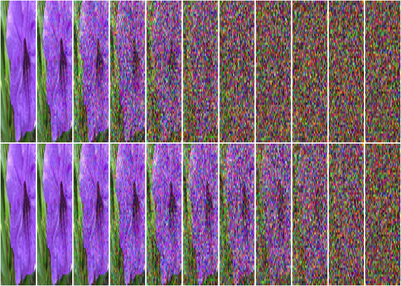
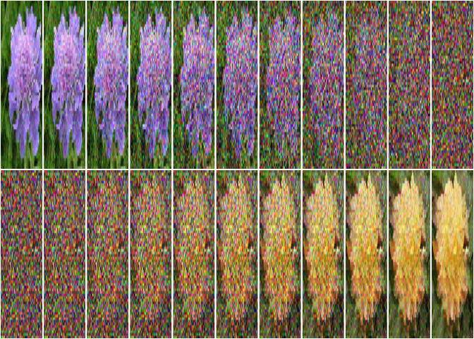
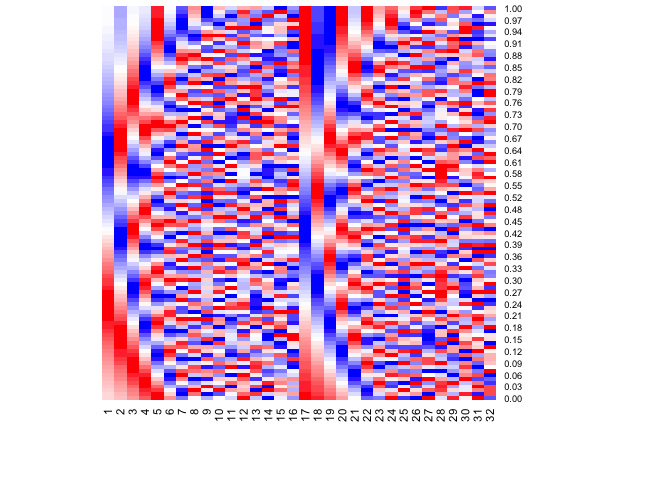
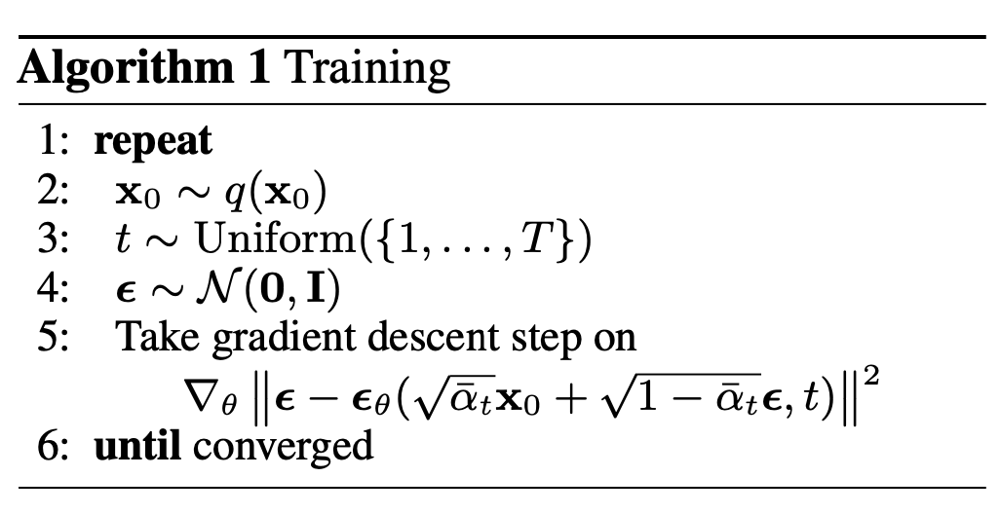
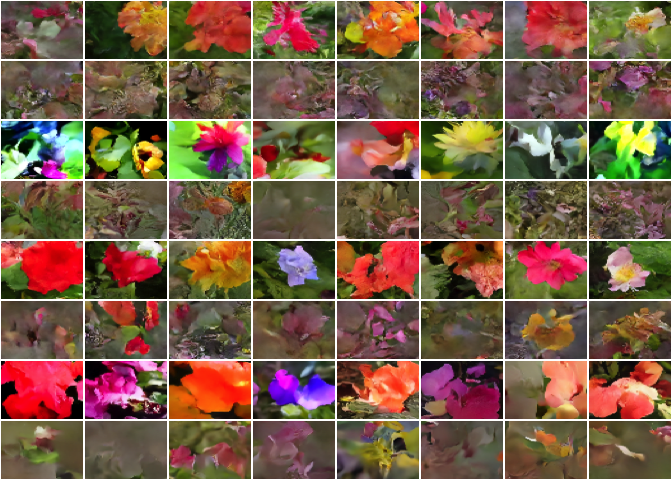
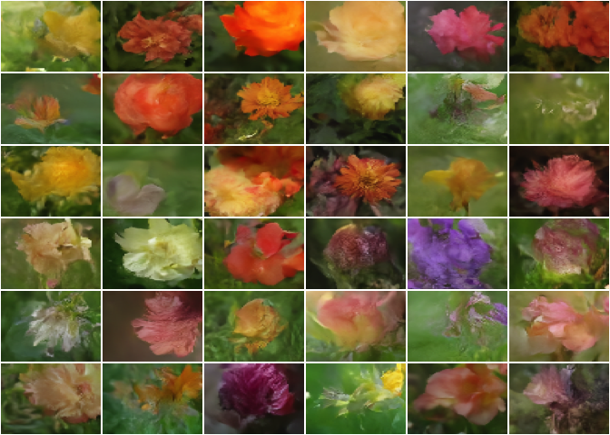

Denoising Diffusion Models
================

This repository contains a torch/luz implementation of the Denoising
Diffusion Implicit Models. Code in this repository is heavily influenced
by code in Béres (2022) which is mostly based on (Song, Meng, and Ermon
2020) with a few ideas coming from (Nichol and Dhariwal 2021) and
(Karras et al. 2022).

Denoising Diffusion models are inspired by non-equilibrium
thermodynamics (Sohl-Dickstein et al. 2015). First a forward diffusion
algorithm is defined, this procedure converts any complex data
distribution into a simple tractable distribution. We then learn a
procedure to reverse the diffusion process.

While there’s a strong theory foundation for denoising diffusion models,
in practice, the core component is a neural network capable of
separating a noisy image in its image and noise parts. For sampling new
images we can then take pure noise and successively ‘denoise’ it until
it’s just the image part.

## Forward diffusion

Originaly the forward diffusion process has been defined as a Markov
process that successively (for eg. for $T$ time steps) adds Gaussian
noise[^1] to the data distribution until the resulting distribution is a
standard Gaussian distribution. If we label the data distribution as
$q(x_{0})$ we have the forward process defined as:

$$q(x_{t} | x_{t-1}) = \mathcal{N}(x_{t-1} \sqrt{1 - \beta_t}, I\beta_t )$$
where $\beta_t$ is the diffusion rate and $\beta_t \in (0,1)$. $\beta_t$
could be learned as in Sohl-Dickstein et al. (2015), but usually a
pre-defined schedule is used.

One important property of this process is that you can easily sample
from $q(x_t | x_0)$. Using a reparametrization trick derived in (Ho,
Jain, and Abbeel 2020) (see also (Weng 2021)) one can express:

$$q(x_t | x_0) = \mathcal{N}(\sqrt{\bar{\alpha_t}}x_0, \sqrt{1-\bar{\alpha_t}}I)$$
And thus, $x_t$ can be expressed as a linear combination of $x_0$ and a
Gaussian noise variable $\epsilon = \mathcal{N}(0, I)$:

$$x_t = \sqrt{\bar{\alpha_t}}x_0 + \sqrt{1-\bar{\alpha_t}}\epsilon$$

### Setting the diffusion rate

The diffusion rate $\bar{\alpha_t}$ schedule is in general a decreasing
sequence of values, such that when $t$ is large, $x_t$ is almost pure
noise. In our implementation the schedule is defined in terms of a
continuous time variable so that we can change the number of diffusion
steps as much as needed during sampling. $\bar{\alpha_t}$ is interpreted
as the proportion of variance that comes from the original image ($x_0$)
in $x_t$.

In Song, Meng, and Ermon (2020) and Ho, Jain, and Abbeel (2020), a so
called linear schedule is used. However the linearity is happening on
$\beta_t$ - before the reparametrization. Thus, $\bar{\alpha_t}$ under
the linear schedule doesn’t vary linearly. Nichol and Dhariwal (2021)
proposes that a cosine schedule can lead to better model performance,
the cosine schedule is applied directly in $\bar{\alpha_t}$.

Below we can visualize the forward diffusion process with both the
linear and cosine scheduling for 10 diffusion steps.

<figure>

<figcaption aria-hidden="true">Samples from <span
class="math inline"><em>q</em>(<em>x</em><sub><em>t</em></sub>|<em>x</em><sub>0</sub>)</span>
for linearly spaced values of <span
class="math inline"><em>t</em></span> with linear schedule (top) and the
cosine schedule (bottom). We can see that with the linear schedule,
images become almost pure noise after the first half - this seems to
interfere in model performance according to <span class="citation"
data-cites="nichol2021">Nichol and Dhariwal (2021)</span> .</figcaption>
</figure>

Also in practice, we never let $\bar{\alpha_t} = 0$ or
$\bar{\alpha_t} = 1$ and instead limit it into a minimum and maximum
signal rate to avoid training stability issues.

## Reverse diffusion

The forward diffusion process thus is a fixed procedure to generate
samples of $q(x_t|x_0)$, we are interested though in generating samples
from $q(x_{t-1} | x_t)$ - known as reverse diffusion. Successively
sampling this way would allow us to sample from $q(x_0 | x_T)$, ie,
sample from the data distribution using only Gaussian noise.

As $q(x_{t-1} | x_t)$ is an unknown distribution, we will train a neural
network $p_{\theta}(x_{t-1} | x_t, \bar{\alpha_t})$ to approximate it.
We will skip the math details here, but a good step by step on the math
can be found in (Weng 2021).

The intuition though is that, we have $x_t$ and we know that it can be
expressed as:

$$x_t = \sqrt{\bar{\alpha_t}}x_0 + \sqrt{1-\bar{\alpha_t}}\epsilon$$

Thus, if we can estimate $x_0$ from $x_t$ , since we know
$\bar{\alpha_t}$ for every $t$ , we can then sample from $x_{t-1}$ by
reusing the above equation. With this simplified view, our goal then is
to train a neural networks that takes $x_t$ as input and returns an
estimate $\hat{x}_0$ for $x_0$. Since we know how to sample from
$q(x_t|x_0)$ we can generate as much training samples as needed. We can
train this neural network to minimize $||x_0 - \hat{x}_0||^2$ or any
other norm.

There’s another way to get an estimate $\hat{x}_0$ though. If we get an
estimate $\hat{\epsilon}$, we can replace it in the above equation and
get an estimate for $x_0$. Empirically, this has been found by (Ho,
Jain, and Abbeel 2020) to lead into better samples and training
stability.

<figure>

<figcaption aria-hidden="true">Forward diffusion (top) and reverse
diffusion (bottom) using 10 difusion steps. The resulting noise from the
forward diffusion process was used as input noise for the reverse
diffusion process.</figcaption>
</figure>

## Neural network architecture

Although denoising diffusion models can work with whatever kind of data
distribution $q(x_0)$ that you might want to sample from, in this
example we will apply it to image datasets. Thus $q(x_0)$ is the data
distribution of images in the selected dataset.

Since we are dealing with images, we will use neural network
architectures that are adapted for that domain. The neural network we
are building takes a noisy image sampled from $q(x_t|x_0)$ and the
variance $\bar{\alpha_t}$ and returns an estimate $\hat{\epsilon}$. Both
$x_t$ and $\epsilon$ have the same dimensions which is 3D tensors with
$(C, H, W)$ where $C=3$ is the number of channels and $H$ and $W$ are
respectively the height and width of the images. Typically $H=W$ since
we are going to use squared images.

The core part of the neural network is a U-Net (Ronneberger, Fischer,
and Brox 2015), which is a common architecture in domains where both the
input and the output are image-like tensors. The U-Net takes as input a
concatenation of $x_t$ with the sinusoidal embedding (Vaswani et al.
2017) of $1 - \bar{\alpha_t}$. Embedding the noise variance into the
model is very important as it allows the network to be sensible to
different amount of noise, and thus being able to make good estimates
for $x_{t-1}$ no matter the actual $t$. The output of the U-Net is then
passed to a simple convolution layer that just processes it into a lower
depth version.

### Sinusoidal embedding

A sinusoidal embedding (Vaswani et al. 2017) is used to encode the
diffusion times (or the noise variance) into the model. The
visualization below shows how diffusion times are mapped to the
embedding - assuming the dimension size of 32. Each row is a embedding
vector given the diffusion time. Sinusoidal embedding have nice
properties, like preserving the relative distances (Kazemnejad 2019).



You can find the code dor the sinusoidal embedding in `diffusion.R`.

### U-Net

A U-Net is a convolutional neural network that successively downsamples
the image resolution while increasing its depth. After a few
downsampling blocks, it starts upsampling the representation and
decreasing the channels depth. The main idea in U-Net, is that much like
Residual Networks, the upsampling blocks take as input both the
representation from the previous upsampling block and the representation
from a previous downsampling block.

<figure>

<figcaption aria-hidden="true">Unet model</figcaption>
</figure>

Unlike the original U-Net implementation, we use ResNet Blocks (He et
al. 2015) in the downsampling and upsampling blocks of the U-Net. Each
down or upsampling blocks contain *block_depth* of those ResNet blocks.
We also use the [Swish
activation](https://en.wikipedia.org/wiki/Swish_function) function.

(Song, Meng, and Ermon 2020) and (Ho, Jain, and Abbeel 2020) also use an
attention layer at lower resolutions, but we didn’t for simplicity. The
code for the U-Net can be found in `unet.R`.

### NN module

Given the definitions of `unet` and the `sinusoidal_embedding` we can
implement the diffusion model with:

``` r
diffusion <- nn_module(
  initialize = function(image_size, embedding_dim = 32, widths = c(32, 64, 96, 128), 
                        block_depth = 2) {
    self$unet <- unet(2*embedding_dim, embedding_dim, widths = widths, block_depth)
    self$embedding <- sinusoidal_embedding(embedding_dim = embedding_dim)

    self$conv <- nn_conv2d(image_size[1], embedding_dim, kernel_size = 1)
    self$upsample <- nn_upsample(size = image_size[2:3])

    self$conv_out <- nn_conv2d(embedding_dim, image_size[1], kernel_size = 1)
    # we initialize at zeros so the initial output of the network is also just zeroes
    purrr::walk(self$conv_out$parameters, nn_init_zeros_)
  },
  forward = function(noisy_images, noise_variances) {
    embedded_variance <- noise_variances |>
      self$embedding() |>
      self$upsample()

    embedded_image <- noisy_images |>
      self$conv()

    unet_input <- torch_cat(list(embedded_image, embedded_variance), dim = 2)
    unet_output <- unet_input %>%
      self$unet() %>%
      self$conv_out()
  }
)
```

With the default hyper-parameters here’s the diffusion model summary:

``` r
diffusion(image_size = c(3, 64, 64))
```

    An `nn_module` containing 3,562,211 parameters.

    ── Modules ─────────────────────────────────────────────────────────────────────
    • unet: <nn_module> #3,561,984 parameters
    • embedding: <nn_module> #0 parameters
    • conv: <nn_conv2d> #128 parameters
    • upsample: <nn_upsample> #0 parameters
    • conv_out: <nn_conv2d> #99 parameters

## Training

The model is trained to learn $q(x_{t-1} | x_t)$. At each iteration we
sample random $t$ values and $x_0$ images, we then apply the forward
diffusion transformation, so that we obtain $x_t$. We then get the
estimate of $\hat{\epsilon}$ using our neural network
$f_{\theta}(x_t, \bar{\alpha_t})$, compute the loss
$MAE(\epsilon, \hat{\epsilon})$ and backprop it to update the neural
network parameters $\theta$.

<figure>

<figcaption aria-hidden="true">The training algorithm pseudocode from
<span class="citation" data-cites="ho2020">Ho, Jain, and Abbeel
(2020)</span></figcaption>
</figure>

In luz, since this is not a conventional supervised model, we implement
the training logic in the `step()` method of the diffusion module, which
looks like:

``` r
diffusion_model <- nn_module(  
  ... # other method omitted for chose focus
  step = function() {
    # images are standard normalized
    ctx$input <- images <- ctx$model$normalize(ctx$input)
    
    # sample random diffusion times and use the scheduler to obtain the amount
    # of variance that should be applied for each t
    diffusion_times <- torch_rand(images$shape[1], 1, 1, 1, device = images$device)
    rates <- self$diffusion_schedule(diffusion_times)

    # forward diffusion - generate x_t
    noises <- torch_randn_like(images)
    images <- rates$signal * images + rates$noise * noises

    # 'denoises' the noisy images.
    # creates predictions for the image and noise part
    ctx$pred <- ctx$model(images, rates)
    loss <- self$loss(noises, ctx$pred$pred_noises)

    # this `step()` method is also applied during validation. 
    # we only want to backprop during training though
    if (ctx$training) {
      ctx$opt$zero_grad()
      loss$backward()
      ctx$opt$step()
    }

    # saves the loss for correctly reporting metrics in luz
    ctx$loss[[ctx$opt_name]] <- loss$detach()
  }
  ...
)
```

### Configuration

We use [GuildAI](https://guild.ai) for training configuration. The
[guildai](https://github.com/guildai/guildai-r) automatically parses the
`train.R` script and allow us to change any scalar value defined in the
top level of the file.

For instance, you can run the training script with the default values
using:

``` r
guildai::guild_run("train.R")
```

You can supply different hyperparameter values by using the `flags`
argument, eg:

``` r
guildai::guild_run("train.R", flags = list(batch_size = 128))
```

Besides allowing configuring the training hyper-parameters, GuildAI also
tracks all experiment files and results. Since we are passing
`luz_callback_tfevents()` to `fit` when training the diffusion model,
all metrics will also be logged and can be visualized in the [Guild
View](https://my.guild.ai/t/guild-view/167) dashboard and accessed using
`guildai::runs_info()`.

### Experiments

We ran experiments for two different datasets:

- Oxford pets
- Oxford flowers

For each dataset we experimented with 3 configuration options, leaving
all other hyper-parameters fixed with the default values. Those were:

- `loss` function : ‘mae’ and ‘mse’
- `loss_on`: ‘noise’ and ‘image’ - wether the model is predicting the
  images or noise values.
- `schedule_type`: ‘linear’ or ‘cosine’

Taking advantage of GuildAI integration, experiments can be run with:

``` r
guildai::guild_run("train.R", flags = list(
  dataset_name = c("pets", "flowers"),
  loss = c("mae", "mse"),
  loss_on = c("noise", "image"),
  schedule_type = c("linear", "cosine"),
  num_workers = 8
))
```

The results for the flowers dataset are shown below:

``` r
runs <- guildai::runs_info(label = "flowers_exp1")
runs |> 
  tidyr::unpack(c(flags, scalars)) |> 
  dplyr::select(
    loss = loss, 
    loss_on = loss_on, 
    schedule_type = schedule_type,
    noise_loss,
    image_loss,
    kid
  ) %>% 
  knitr::kable()
```

| loss | loss_on | schedule_type | noise_loss | image_loss |       kid |
|:-----|:--------|:--------------|-----------:|-----------:|----------:|
| mse  | image   | cosine        |  0.4835953 |  0.7167605 | 0.3655073 |
| mse  | image   | linear        |  0.3766442 |  0.8138317 | 0.3649815 |
| mse  | noise   | cosine        |  0.1653200 |  0.2689797 | 0.1118684 |
| mse  | noise   | linear        |  0.1400425 |  0.3130383 | 0.1755732 |
| mae  | image   | cosine        |  0.4836761 |  0.7168015 | 0.3657972 |
| mae  | image   | linear        |  0.3765011 |  0.8135592 | 0.3649954 |
| mae  | noise   | cosine        |  0.1645384 |  0.2612465 | 0.0667027 |
| mae  | noise   | linear        |  0.1390513 |  0.3053726 | 0.1622408 |

We can see that given that the other hyper-parameters are fixed, it’s
better to train the neural network on the MAE of the noises using a
cosine schedule. Below we compare images generated for each different
run. The ordering is the same as the table above, so you can visualize
the effect of different values of KID.

``` r
images <- runs$dir |> 
  lapply(function(x) {
    model <- luz::luz_load(file.path(x, "luz_model.luz"))
    with_no_grad({
      model$model$eval()
      model$model$generate(8)  
    })
  })

images |>
  lapply(function(x) torch::torch_unbind(x)) |>
  unlist() |>
  plot_tensors(ncol = 8, denormalize = identity)
```



## Sampling images

Images can be sampled from the model using the `generate` method.
Remember to always set the model into `eval()` mode before sampling, so
the batch normal layers are correctly applied.

``` r
box::use(torch[...])
box::use(./callbacks[plot_tensors])

fitted <- luz::luz_load("luz_model.luz")

with_no_grad({
  fitted$model$eval()
  x <- fitted$model$generate(36, diffusion_steps = 5)$to(device = "mps")
})

plot_tensors(x)
```



## References

<div id="refs" class="references csl-bib-body hanging-indent">

<div id="ref-bansal2022" class="csl-entry">

Bansal, Arpit, Eitan Borgnia, Hong-Min Chu, Jie S. Li, Hamid Kazemi,
Furong Huang, Micah Goldblum, Jonas Geiping, and Tom Goldstein. 2022.
“Cold Diffusion: Inverting Arbitrary Image Transforms Without Noise.”
<https://doi.org/10.48550/ARXIV.2208.09392>.

</div>

<div id="ref-kerasDDIM" class="csl-entry">

Béres, András. 2022. “Denoising Diffusion Implicit Models.”
<https://keras.io/examples/generative/ddim/>.

</div>

<div id="ref-he2015" class="csl-entry">

He, Kaiming, Xiangyu Zhang, Shaoqing Ren, and Jian Sun. 2015. “Deep
Residual Learning for Image Recognition.”
<https://doi.org/10.48550/ARXIV.1512.03385>.

</div>

<div id="ref-ho2020" class="csl-entry">

Ho, Jonathan, Ajay Jain, and Pieter Abbeel. 2020. “Denoising Diffusion
Probabilistic Models.” <https://doi.org/10.48550/ARXIV.2006.11239>.

</div>

<div id="ref-karras2022" class="csl-entry">

Karras, Tero, Miika Aittala, Timo Aila, and Samuli Laine. 2022.
“Elucidating the Design Space of Diffusion-Based Generative Models.”
<https://doi.org/10.48550/ARXIV.2206.00364>.

</div>

<div id="ref-kazemnejad2019:pencoding" class="csl-entry">

Kazemnejad, Amirhossein. 2019. “Transformer Architecture: The Positional
Encoding.” *Kazemnejad.com*.
<https://kazemnejad.com/blog/transformer_architecture_positional_encoding/>.

</div>

<div id="ref-nichol2021" class="csl-entry">

Nichol, Alex, and Prafulla Dhariwal. 2021. “Improved Denoising Diffusion
Probabilistic Models.” <https://doi.org/10.48550/ARXIV.2102.09672>.

</div>

<div id="ref-ronneberger2015" class="csl-entry">

Ronneberger, Olaf, Philipp Fischer, and Thomas Brox. 2015. “U-Net:
Convolutional Networks for Biomedical Image Segmentation.”
<https://doi.org/10.48550/ARXIV.1505.04597>.

</div>

<div id="ref-sohl-dickstein2015" class="csl-entry">

Sohl-Dickstein, Jascha, Eric A. Weiss, Niru Maheswaranathan, and Surya
Ganguli. 2015. “Deep Unsupervised Learning Using Nonequilibrium
Thermodynamics.” <https://doi.org/10.48550/ARXIV.1503.03585>.

</div>

<div id="ref-song2020" class="csl-entry">

Song, Jiaming, Chenlin Meng, and Stefano Ermon. 2020. “Denoising
Diffusion Implicit Models.” <https://doi.org/10.48550/ARXIV.2010.02502>.

</div>

<div id="ref-vaswani2017" class="csl-entry">

Vaswani, Ashish, Noam Shazeer, Niki Parmar, Jakob Uszkoreit, Llion
Jones, Aidan N. Gomez, Lukasz Kaiser, and Illia Polosukhin. 2017.
“Attention Is All You Need.”
<https://doi.org/10.48550/ARXIV.1706.03762>.

</div>

<div id="ref-weng2021diffusion" class="csl-entry">

Weng, Lilian. 2021. “What Are Diffusion Models?” *Lilianweng.github.io*,
July. <https://lilianweng.github.io/posts/2021-07-11-diffusion-models/>.

</div>

</div>

[^1]: (Bansal et al. 2022) seems to show that any lossy image
    transformation works
