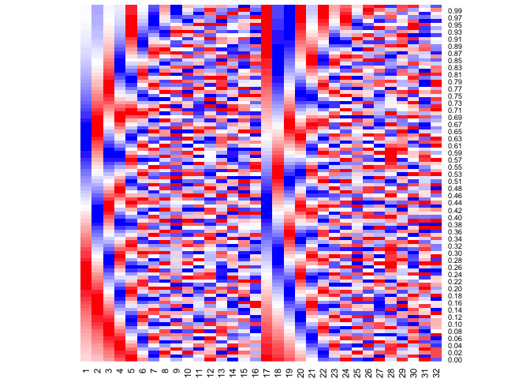
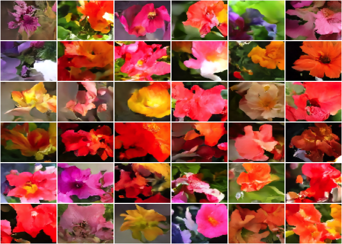

Denoising Diffusion Models
================

This repository contains a torch/luz implementation of the Denoising
Diffusion Implicit Models. Code in this repository is heavily influenced
by code in Béres (2022) which is mostly based on (Song, Meng, and Ermon
2020) with a few ideas coming from (Nichol and Dhariwal 2021) and
(Karras et al. 2022).

Denoising Diffusion models are inspired by non-equilibrium
thermodynamics (Sohl-Dickstein et al. 2015). First a forward diffusion
algorithm is defined, this procedure converts any complex data
distribution into a simple tractable distribution. We then learn a
procedure to reverse the diffusion process.

While there’s a strong theory foundation for denoising diffusion models,
in practice, the core component is a neural network capable of
separating a noisy image in its image and noise parts. For sampling new
images we can then take pure noise and successively ‘denoise’ it until
it’s just the image part.

## Forward diffusion

Originaly the forward diffusion process has been defined as a Markov
process that successively (for eg. for $T$ time steps) adds Gaussian
noise[^1] to the data distribution until the resulting distribution is a
standard Gaussian distribution. If we label the data distribution as
$q(x_{0})$ we have the forward process defined as:

$$q(x_{t} | x_{t-1}) = \mathcal{N}(x_{t-1} \sqrt{1 - \beta_t}, I\beta_t )$$
where $\beta_t$ is the diffusion rate and $\beta_t \in (0,1)$. $\beta_t$
could be learned as in Sohl-Dickstein et al. (2015), but usually a
pre-defined schedule is used.

One important property of this process is that you can easily sample
from $q(x_t | x_0)$. Using a reparametrization trick derived in (Ho,
Jain, and Abbeel 2020) (see also (Weng 2021)) one can express:

$$q(x_t | x_0) = \mathcal{N}(\sqrt{\bar{\alpha_t}}x_0, \sqrt{1-\bar{\alpha_t}}I)$$
And thus, $x_t$ can be expressed as a linear combination of $x_0$ and a
Gaussian noise variable $\epsilon = \mathcal{N}(0, I)$:

$$x_t = \sqrt{\bar{\alpha_t}}x_0 + \sqrt{1-\bar{\alpha_t}}\epsilon$$

### Setting the diffusion rate

The diffusion rate $\bar{\alpha_t}$ schedule is in general a decreasing
sequence of values, such that when $t$ is large, $x_t$ is almost pure
noise. In our implementation the schedule is defined in terms of a
continuous time variable so that we can change the number of diffusion
steps as much as needed during sampling. $\bar{\alpha_t}$ is interpreted
as the proportion of variance that comes from the original image ($x_0$)
in $x_t$.

In Song, Meng, and Ermon (2020) and Ho, Jain, and Abbeel (2020), a so
called linear schedule is used. However the linearity is happening on
$\beta_t$ - before the reparametrization. Thus, $\bar{\alpha_t}$ under
the linear schedule doesn’t vary linearly. Nichol and Dhariwal (2021)
proposes that a cosine schedule can lead to better model performance,
the cosine schedule is applied directly in $\bar{\alpha_t}$.

Below we can visualize the forward diffusion process with both the
linear and cosine scheduling for 10 diffusion steps.

<figure>

<figcaption aria-hidden="true">Samples from <span
class="math inline"><em>q</em>(<em>x</em><sub><em>t</em></sub>|<em>x</em><sub>0</sub>)</span>
for linearly spaced values of <span
class="math inline"><em>t</em></span> with linear schedule (top) and the
cosine schedule (bottom). We can see that with the linear schedule,
images become almost pure noise after the first half - this seems to
interfere in model performance according to <span class="citation"
data-cites="nichol2021">Nichol and Dhariwal (2021)</span> .</figcaption>
</figure>

## Sinusoidal embedding

A sinusoidal embedding is used to encode the diffusion times into the
model. The visualization below shows how diffusion times are mapped to
the embedding - assuming the dimension size of 32. Each row is a
embedding vector given the diffusion time. Sinusoidal embedding have
nice properties, like preserving the relative distances (Kazemnejad
2019).



## Sampling images

Images can be sampled from the model using the `generate` method.
Remember to always set the model into `eval()` mode before sampling, so
the batch normal layers are correctly applied.

``` r
box::use(torch[...])
box::use(./callbacks[plot_tensors])

fitted <- luz::luz_load("luz_model.luz")

with_no_grad({
  fitted$model$eval()
  x <- fitted$model$generate(36, diffusion_steps = 5)$to(device = "mps")
})

plot_tensors(x)
```



## References

<div id="refs" class="references csl-bib-body hanging-indent">

<div id="ref-bansal2022" class="csl-entry">

Bansal, Arpit, Eitan Borgnia, Hong-Min Chu, Jie S. Li, Hamid Kazemi,
Furong Huang, Micah Goldblum, Jonas Geiping, and Tom Goldstein. 2022.
“Cold Diffusion: Inverting Arbitrary Image Transforms Without Noise.”
<https://doi.org/10.48550/ARXIV.2208.09392>.

</div>

<div id="ref-kerasDDIM" class="csl-entry">

Béres, András. 2022. “Denoising Diffusion Implicit Models.”
<https://keras.io/examples/generative/ddim/>.

</div>

<div id="ref-ho2020" class="csl-entry">

Ho, Jonathan, Ajay Jain, and Pieter Abbeel. 2020. “Denoising Diffusion
Probabilistic Models.” <https://doi.org/10.48550/ARXIV.2006.11239>.

</div>

<div id="ref-karras2022" class="csl-entry">

Karras, Tero, Miika Aittala, Timo Aila, and Samuli Laine. 2022.
“Elucidating the Design Space of Diffusion-Based Generative Models.”
<https://doi.org/10.48550/ARXIV.2206.00364>.

</div>

<div id="ref-kazemnejad2019:pencoding" class="csl-entry">

Kazemnejad, Amirhossein. 2019. “Transformer Architecture: The Positional
Encoding.” *Kazemnejad.com*.
<https://kazemnejad.com/blog/transformer_architecture_positional_encoding/>.

</div>

<div id="ref-nichol2021" class="csl-entry">

Nichol, Alex, and Prafulla Dhariwal. 2021. “Improved Denoising Diffusion
Probabilistic Models.” <https://doi.org/10.48550/ARXIV.2102.09672>.

</div>

<div id="ref-sohl-dickstein2015" class="csl-entry">

Sohl-Dickstein, Jascha, Eric A. Weiss, Niru Maheswaranathan, and Surya
Ganguli. 2015. “Deep Unsupervised Learning Using Nonequilibrium
Thermodynamics.” <https://doi.org/10.48550/ARXIV.1503.03585>.

</div>

<div id="ref-song2020" class="csl-entry">

Song, Jiaming, Chenlin Meng, and Stefano Ermon. 2020. “Denoising
Diffusion Implicit Models.” <https://doi.org/10.48550/ARXIV.2010.02502>.

</div>

<div id="ref-weng2021diffusion" class="csl-entry">

Weng, Lilian. 2021. “What Are Diffusion Models?” *Lilianweng.github.io*,
July. <https://lilianweng.github.io/posts/2021-07-11-diffusion-models/>.

</div>

</div>

[^1]: (Bansal et al. 2022) seems to show that any lossy image
    transformation works
